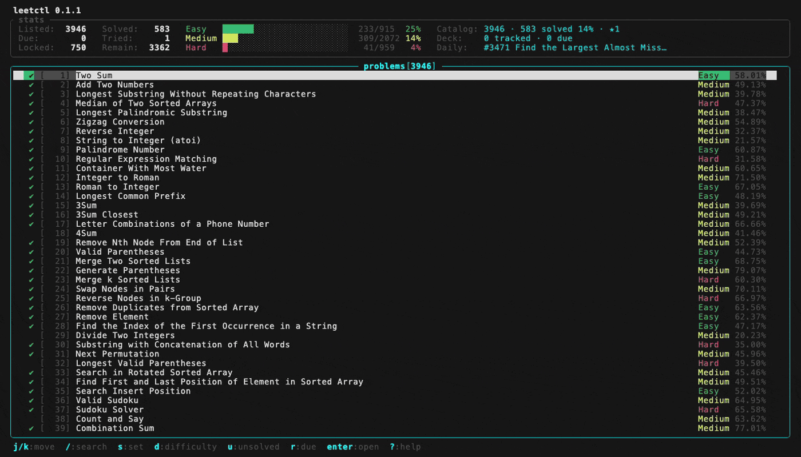

# Terminal UI

`leetctl tui` opens an interactive problem browser: one table of every problem, live filtering by
set / difficulty / tag / free text, the problem description inline, and edit / test / submit without
leaving the screen.

```sh
leetctl tui                          # full catalog
leetctl tui --set blind75            # open pre-filtered
leetctl tui -S neetcode150 -D medium
```

Everything it shows comes from the same cache and the same filter engine as `leetctl list`, so a
count in the TUI stats panel matches `leetctl list --stat` for the equivalent flags. That is a design
constraint, not a coincidence — see [One filter engine](#one-filter-engine).



Re-record that with `make demo` — it needs [vhs](https://github.com/charmbracelet/vhs) and drives
the real cache through [demo.tape](./demo.tape).

## The stats panel

The panel above the table is a row of segments, drawn left to right:

| Segment | Shows | Needs |
| --- | --- | --- |
| counts | `Listed` / `Due` / `Locked` | always drawn |
| counts | `Solved` / `Tried` / `Remain` | 16 more columns |
| bars | solved-versus-total per difficulty | 34 more columns |
| extras | `Catalog` / `Deck` / `Daily` | 31 more columns, and shrinks to fit |

A segment is drawn only once the whole of it fits, so a narrow terminal loses segments from the
right rather than showing half a bar or a clipped number. Whatever width is left after the last
segment widens the bars, up to 24 cells — which is why they stretch on a roomy terminal.

The counts and the bars describe the filtered pool, the same numbers as `leetctl list --stat`. The
extras describe everything cached: the whole catalog, the whole [review deck](./srs.md) (`Due:` on
the left counts only what is listed), and today's challenge.

## Keys

| Key | Where | Does |
| --- | --- | --- |
| `j` / `k`, `↓` / `↑` | list, detail | move / scroll |
| `g` `g`, `G` | list, detail | top / bottom |
| `Ctrl-d` / `Ctrl-u` | list, detail | page down / up |
| `Enter` | list | open the description |
| `Esc` / `q` | description, help | back |
| `/` | list | search prompt: space-separated tokens are ANDed, `!token` excludes |
| `s` | list | set picker (`j`/`k`, `enter` applies, `x` clears the set, `esc` closes) |
| `d` | list | cycle difficulty: all → easy → medium → hard |
| `u` | list | toggle unsolved-only |
| `r` | list | toggle due-only — the [review deck](./srs.md) |
| `t` | list | filter by tag — a LeetCode tag slug, looked up over the network |
| `esc` | list | drop every filter at once |
| `D` | list | jump to today's daily challenge |
| `e` | list, detail | open the solution file in `$EDITOR` |
| `t` | description | run the sample tests |
| `S` | description | submit — asks `y` / `n` first |
| `j` / `k`, `esc` | result pane | scroll the result, or close it |
| `1` / `2` / `3` / `4` | description | grade recall: again / hard / good / easy |
| `?` | anywhere | help |
| `q` | list | quit |

Descriptions are fetched once and kept for the session, so reopening a problem is instant. The
daily challenge is looked up at startup to badge its row with ★, and `D` jumps to it — dropping the
filters first if they hide it, because being sent to a row that is not on screen reads as the key
having done nothing.

Searching matches tokens as substrings of the id, name, slug, difficulty, and status together, so
`easy !ac tree` reads as "easy tree problems I have not solved". It is substring-only on purpose:
subsequence matching (typing `lcp` for *Longest Common Prefix*) needs ranking to stay useful, and
without it three letters match hundreds of four thousand problems.

`e` prepares the solution file exactly as `leetctl edit` does, including the language markers and
the test-case file, then hands the terminal to your editor. Editor resolution is unchanged —
`$VISUAL`, then `$EDITOR`, then `code.editor` from the config. See [editors](./editors.md).

`t` and `S` run one at a time, with a spinner and an elapsed count while LeetCode judges. The result
opens in a pane over the description, scrollable, with `t` and `S` available again from there. An
accepted submission flips the row to solved immediately — the cache row is written by the submission
itself, but the copies on screen have to be told.

## Architecture

### The loop

One `std::sync::mpsc` channel is the only place events converge. Three producers:

- an **input thread** turning crossterm key events into `Msg::Key`,
- **tokio tasks** for anything touching the cache or the network,
- a **spinner ticker**, alive only while a test or submit is in flight.

The UI thread does `draw` → `recv` → `handle` → drain the queue, and never blocks on I/O. State
lives in one `Model`; every transition goes through `Model::handle(Msg)`, which makes the whole
frontend testable without a terminal. This is the pattern smew uses (`src/tui/app/run.rs`).

### Threading contract

The runtime lives where it always did — `src/bin/leetctl.rs`. `TuiArgs::run` takes a
`tokio::runtime::Handle`, then puts the entire synchronous UI loop on a blocking-pool thread with
`spawn_blocking`. Backend work is `handle.spawn(async move { … tx.send(Msg::…) })`; results carry a
generation counter, and results from a superseded generation are dropped rather than applied.

Diesel is synchronous. Its calls ride inside those spawned tasks, on runtime worker threads — never
on the UI thread. They are single-table reads against a local SQLite file, so there is no
`spawn_blocking` wrapper per query; the thing that matters is that the render loop only ever
receives messages.

### Suspending for the editor

`e` cannot just spawn the editor: two readers on the same tty fight over keystrokes. So the UI
thread sets a `suspended` flag, the input thread stands down after its current 150 ms poll, the
terminal is restored (alt screen off, raw mode off), the editor runs to completion, and then the
terminal is re-initialized and the input thread resumes. The editor owns the terminal for as long as
it is open, which is why blocking the UI thread here is correct rather than a compromise.

Resuming deliberately does **not** call `Terminal::clear`: that asks the terminal where the cursor
is and waits for the answer (`ratatui-core`'s `buffers.rs`), which not every terminal sends — the
first version of this hung there and then exited. A freshly initialized terminal has an empty back
buffer, so the next draw repaints every cell anyway.

### One filter engine

`ProblemFilters` + `filters::apply` in `src/filters.rs` is shared by `leetctl list`, `--stat`, and
the TUI. The TUI adds only the interactive text matcher on top of it. A filter that behaves
differently in the two frontends is therefore a bug in one shared function, not a divergence to
reconcile.

### Why the library layer changes first (phase 1)

Three things in the cache layer are fine for a CLI and fatal for a TUI, so they are fixed before any
TUI code is written:

- `Cache::get_question` prints a banner to stdout (`src/cache/mod.rs`). Any print lands on top of
  the alt screen. It moves to `Problem::banner()`, printed by the commands that want it.
- `VerifyResult`'s `Display` impl **writes to SQLite** (`Cache::new()` + `update_after_ac`, in
  `src/cache/models.rs`) on submit success, and `expect`s its way through failures. A render path
  must not write to a database, and must not panic. That write moves into `Cache::exec_problem`,
  where the submit actually completes.
- `conn()` panics when the database cannot be opened. It returns a `Result`.

Two invariants follow, and future work should keep them: **the cache layer does not print**, and
**`Display` impls have no side effects** — which includes not panicking. Formatting a submission that
failed some of its cases used to index into an output list LeetCode leaves empty, so `leetctl exec`
panicked and the TUI would have died mid-draw.

`leetctl tui` also forces `colored` off process-wide, so any string it borrows from a `Display` impl
arrives free of ANSI escapes, and initializes the logger at `off` unless `--debug` is set — a stray
`info!` would otherwise paint over the screen on a cold cache.

## Deliberately not in v1

- **Watch mode.** `e` then `t` already closes the loop; `leetctl test --watch` stays a CLI feature.
- **Mouse, themes, configurable keys.** Fifteen keys and three screens do not need an indirection
  layer, and difficulty colors follow the CLI's existing green / yellow / red.
- **Category, id-range, and `--plan` filters.** They exist on `leetctl list` and are a poor fit for
  an interactive panel.
- **Language switching, starring, a settings screen.**

## Roadmap

| Phase | Scope | Status |
| ---: | --- | --- |
| 0 | This document | Merged |
| 1 | Print-free, panic-free, side-effect-free cache layer | Merged |
| 2 | Shared filter / stats engine; extract the code-file scaffold | Merged |
| 3 | `leetctl tui`, event loop, problem table | Merged |
| 4 | Filtering: text, set, difficulty, tag | Merged |
| 5 | Detail view, help, daily challenge | Merged |
| 6 | Edit, test, submit | Merged |
| 7 | Stats panel above the table: counts, difficulty bars, catalog / deck / daily | Merged |

Phases 1 and 2 are behavior-preserving refactors of the existing commands: `leetctl list`, `pick`,
`edit`, `test`, and `exec` must produce identical output across them, with one documented exception
(the first-run "is on the run..." banner no longer appears mid-`test`, because the cache layer
stopped printing).

## Checking it by hand

The automated tests render each screen through ratatui's `TestBackend` and drive `Model::handle`
with message sequences, which covers layout and state but not the terminal itself. What needs a
human:

1. Delete the cache and start `leetctl tui` — the download runs with no log lines leaking onto the
   screen.
2. `/two !sum`, then `s` → `blind75`, then `d` twice: the stats panel counts match
   `leetctl list -S blind75 -D medium --stat`, and its bars shrink with the pool.
3. `Enter`, `D`, `?` — description, daily, help.
4. `e` with a terminal editor (`nvim`) and with a windowed one (`code -w`): keystrokes during the
   edit are not swallowed by the TUI, and the screen comes back intact.
5. `t` shows a spinner then a result; `S` asks first, and an accepted submission flips the row to
   solved immediately. Expired cookies show the error in full.
6. Resize to 20×10 without a panic. After `q`, after `Ctrl-C`, and after a forced panic, `stty -a`
   shows raw mode off.
